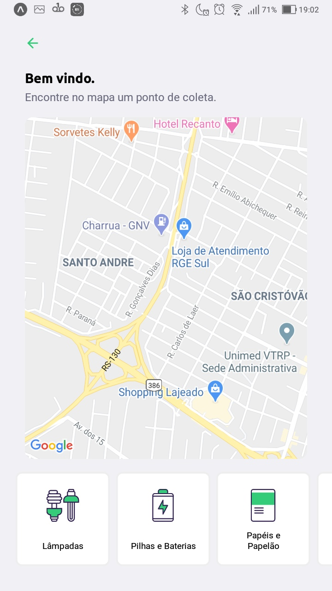
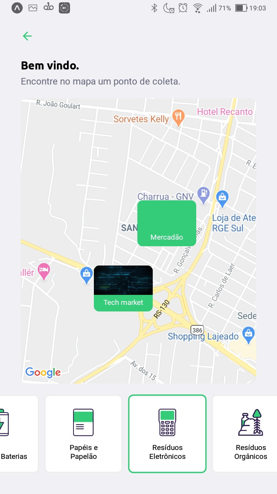

# Descrição
O projeto foi desenvolvido durante a Next Level Week #1 (NLW#1) oferecido pela [Rocket Seat](https://rocketseat.com.br/).

Após aproximadamente 10 horas de aulas, chegamos a um projeto que consiste em um Marketplace de coleta de resíduos. Desenvolvendo o Backend em node, front em react e o mobile em react native.

# Responsabilidades de cada módulo
## Backend
1. Servir informações para o frontend web como também para o mobile;
2. Efetuar o cadastro de novos registros.

## Frontend Web
1. Cadastrar novos pontos de coleta de resíduos.

## Mobile
1. Consultar pontos de coleta através de filtros de cidades, estados e tipo de resíduo a ser coletado.

# Instalação + execução dos projetos
## Pré requisitos
1. Nodejs
2. NPM

## Instalação do backend
```
# Navegar para o diretório do backend
$ cd server

# Instalar
$ npm install

# Executar o projeto
$ npm run dev
```
### Ajuste de URL
Como as Urls estão fixas para o desenvolvimento, verificar se vai ser necessário a alteração da baseURL no arquivo `./server/src/controllers/ItemsController.ts`.

## Instalação do frontend
```
# Navegar para o diretório do frontend
$ cd web

# Instalar
$ npm install

# Executar o projeto
$ npm run dev
```
### Ajuste de URL
Como as Urls estão fixas para o desenvolvimento, verificar se vai ser necessário a alteração da baseURL no arquivo `./web/src/services/api.ts`.

## Instalação do mobile
```
# Navegar para o diretório do mobile
$ cd mobile

# Instalar
$ npm install

# Executar o projeto
$ expo start
```
### Ajuste de URL
Como as Urls estão fixas para o desenvolvimento, verificar se vai ser necessário a alteração da baseURL no arquivo `./mobile/src/services/api.ts`.


## Prints de execução do projeto
### Web
#### Web home page


#### Web create point


### Mobile
#### Inicial

#### Tela principal sem filtro de tipos de resíduos de coleta

#### Tela principal com filtro de tipos de resíduos de coleta

#### Tela de detalhes do ponto de coleta


## Conclusões pessoais sobre o projeto.
Como o projeto foi baseado nas aulas que foram oferecidas, sei que muito conteúdo e muitas validações de segurança ainda são necessárias.

Porém, pude descobrir um pouco mais sobre o desenvolvimento Javascript, em que possuia pouco conhecimento.

Agora é focar nos estudos para aprimorar ainda mais essas skills.